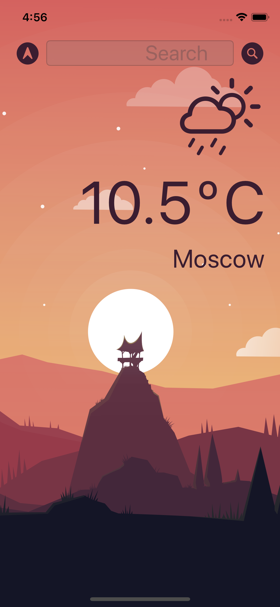
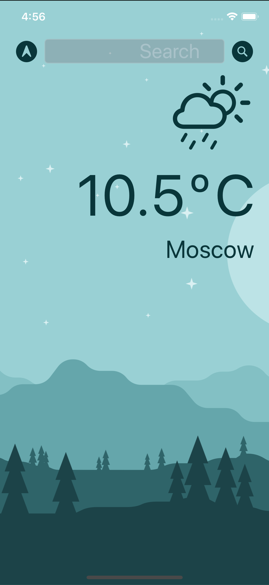

# Clima-iOS13

Приложение для отображения текущей погоды. 

Применена архитектура MVC, определение текущей геолокации пользователя с помощью CoreLocation, 
использован паттерн Delegate, обработка ошибок с протоколом Error, смена UI в DarkMode, Auto Layout, SFSymbols. 
Запрос данных с API с помощью URLSession, обработка ответа JSON с помощью протокола Codable.

